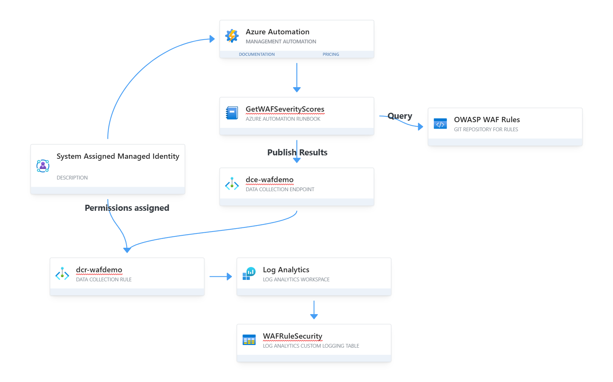

# Project Summary

This project aims to agument an Azure Web Application Firewall (WAF) by adding the Severities and severity scores to a Log Analytics custom table. This will allow you to join your Azure WAF KQL queries for your logs to include the severity of the rule match, along with the associated rule score. The code in this project performs the following tasks:

1. The Architecture Diagram shows all of the resource(s) being created and configured
2. The Automation Account Runbook will be automatically scheduled to run approximately 15 minutes after deployment and will collect all of the rule severities, and populate your custom log analytics table
3. This enables you to perform join operations with this custom table to assess your Azure WAF rule matches

## Architecture Diagram

